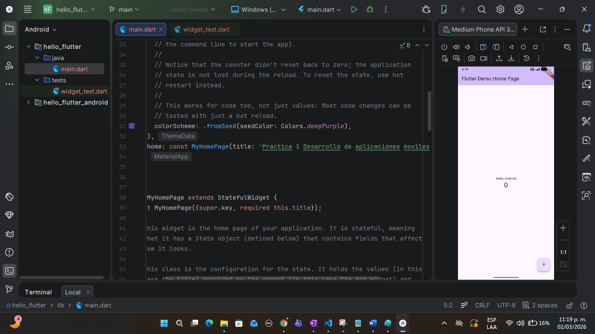

# hello_flutter

# Actividad 1: Hello Android con Flutter

## Descripción del Proyecto
Esta aplicación fue desarrollada como una introducción al entorno de desarrollo móvil. La actividad consistió en la creación de una "Activity" inicial (pantalla principal) que muestra un mensaje de bienvenida y el ciclo de vida básico de una aplicación móvil.

## Descripción de las Activities
- En la pantalla principal  se despliega el widget central con el mensaje "Hello Android"

## Manejo de Transiciones y Ciclo de Vida
- **Ciclo de Vida:** La aplicación utiliza el ciclo de vida gestionado por el Framework. Específicamente, se utiliza el método `initState()` para configurar el estado inicial de la aplicación, similar al `onCreate()` en Android nativo. Para la limpieza de recursos, se cuenta con el método `dispose()`, equivalente a `onDestroy()`.
- **Transiciones:** La navegación y las transiciones entre pantallas se manejan mediante el `Navigator` de Flutter, el cual gestiona una pila de widgets (Stack). Esto permite que el sistema operativo maneje la navegación hacia atrás de manera nativa, asegurando la integridad del ciclo de vida.

## Instrucciones para Ejecutar
1. Asegúrate de tener instalado Flutter SDK y configurado un emulador Android (API 36.1+).
2. Clona este repositorio en tu máquina local.
3. Abre el proyecto en Android Studio o VS Code.
4. Ejecuta el comando en la terminal: `flutter run`.

